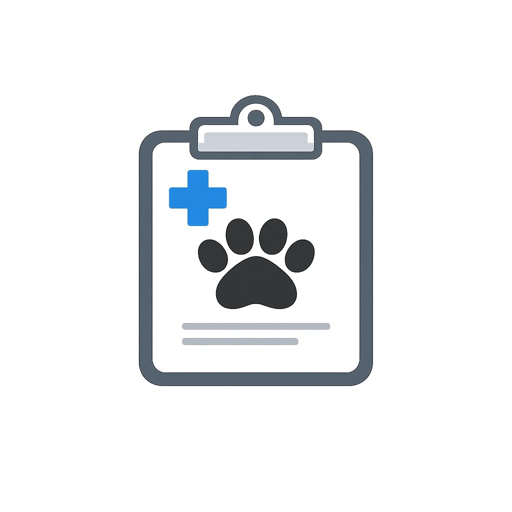
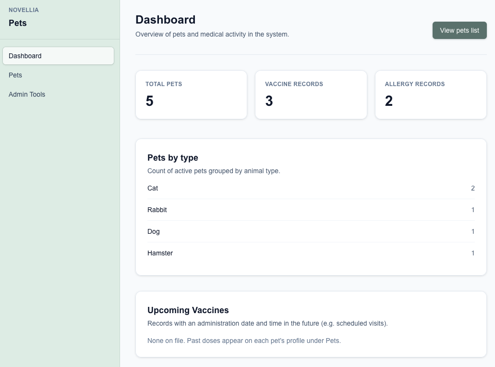

<h1 style="display:flex;align-items:center;gap:0.5rem;line-height:1.2;margin:0 0 0.35em 0;">
  
  Novellia Pets
</h1>

This demo app will track pets' medical histories and basic profile information.

## Local Development (Docker + Hot Reload)

```bash
docker compose up --build
```

Open [http://localhost:3000](http://localhost:3000).

Stop containers:

```bash
docker compose down
```

## Local Development (without Docker)

```bash
npm install
npm run dev
```

## Dashboard (Preview)


